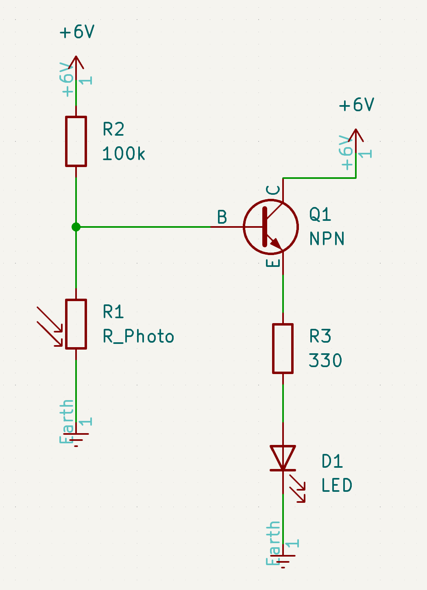

# night-light
I thought I should have some hardware projects on my Github so I decided to start with a fairly simple one. This is a night light that lights up when it's dark enough.

## Components List
- 330 ohm resistor
- 100k ohm resistor
- BC547 (NPN transistor)
- photoresistor
- LED
- power source

## Creation Process
  
Above is the final schematic for this circuit. There are two parts to it, first is the right side which uses an NPN transistor as a switch. The left side is a voltage divider.  
### LED Math
These calculations were done to figure out the required resistance for the LED.
> Typically, the forward voltage of an LED is between 1.8 and 3.3 volts  
-- [Wikipedia](https://en.wikipedia.org/wiki/LED_circuit)

The specific LED I was using has a forward voltage drop of around 2V and needs about 10mA for it to function optimally. Using Ohm's law, we can calculate the required resistance.

$$
R = \frac{V_{power} - V_{forward}}{I} = \frac{6 - 2}{0.01} = 400
$$

I don't have a 400 ohm resistor. 330 is close enough (alternatively 470 would work too but I don't have that either).  
### Transistor as Switch
When looking at the [datasheet](https://www.sparkfun.com/datasheets/Components/BC546.pdf) for the transistor I used, it says the minimum voltage to turn the base on is 580mV. This means as long as a value greater than 580mV is passing through the base, there will be a current flowing from the collector to the emitter.
### Voltage Divider Math
The formula for voltage dividers can be found with a quick search.  

Above is an image from [Wikipedia](https://en.wikipedia.org/wiki/Voltage_divider). Wikipedia also gives us the formula for a voltage divider as 

$$
V_{out} = V_{in}\frac{R_2}{R_1 + R_2}
$$

In the schematics I drew up, $R_2$ of the voltage divider formula is the photoresistor and $R_1$ from the formula is the 100k resistor. This was determined by knowing the resistance of a photoresistor increases as it gets darker and when it's darker, we want more voltage. Since we want voltage and resistance to be porportional, the photoresistor should be $R_2$. I took a multimeter and measured the value of the photoresistor under normal light conditions. It was about 10k. We know $V_{in}$ is 6V and we want $V_{out}$ to be 0.58V so we now need to solve for the value of $R_1$.

$$V_{out} = V_{in}\frac{R_2}{R_1 + R_2}$$

$$0.58 = 6\frac{10}{10 + R_1}$$

$$5.8 + 0.58R_1 = 60$$

$$0.58R_1 = 54.2$$

$$R_1 \approx 93.4$$

I don't have a 93.4k resistor so I used an 100k resistor.
